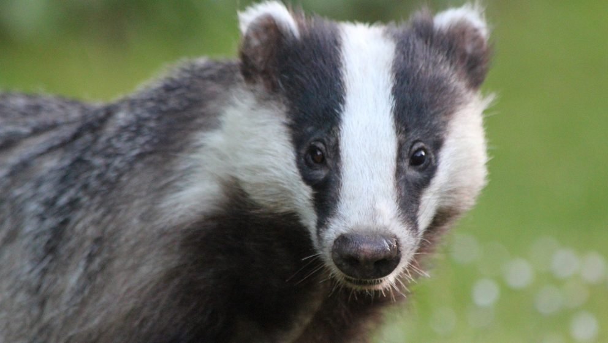

## Badger Facts

One of the more curious badger facts is that a large part of their diet is earthworms. Badgers are stoutly built, powerful and cantankerous carnivores. There are eight species of badger ranging across several continents including North America, Africa, Europe and Asia.

All the badger species are fossorial, creating many-chambered underground dens, and spending much of their lives below ground.

Badgers do allot of stalking at night, but are seen out and about in the daytime as well. They are excellent hunters of earth-dwelling prey including rabbits, groundhogs, ground squirrels, mice and snakes.

Some of these animals can be fairly large in comparison to the badger, but are no match for this enormously aggressive predator.

The badgers sense of smell is very powerful and they can detect an animal in its burrow through soil as well as snow cover. When they locate their prey, they dig rapidly directly down into the animals den in a devastating surprise attack from above.

Badgers also eat a variety of insects, grubs and vegetable matter including fruits and roots.

The word "badger" comes from the French word "becheur" meaning "digger" and is extremely appropriate. Everything about a badgers body says "dig".

It has massive, shovel-like front paws with five powerful toes, each tipped with curved claws as strong as steel. They can move yards of dirt in minutes, barreling in head first with long digging strokes of the front legs and quick, earth-moving shoves backwards with the rear legs.

The rear paws and claws are smaller and designed to doze away the soil that has already been loosened and dislodged by the front feet.

Badgers have a third eyelid that protects their eyes from all the flying soil, and thick guard hairs in their nostrils and ears to keep them clear of debris.

A badger being pursued by a large predator such as a wolf or mountain lion can dig backwards, fangs facing out for protection and disappear beneath the soil in a matter of seconds.

In addition, the badger has very thick fur and loose skin which allows it to twist around, even when having been grabbed from behind by a predator, to defend itself with its impressive canines.

Most badgers live solitary lives once weaned from their mother, but have overlapping territories and may occasionally run into each other and socialize.

# American Or New World Badger Facts
The American badger is a fixture across the plains and woodlands of the central United States. They range into Canada and Mexico as well, but the midwestern plains are their most common residence.

These badgers have a flattened appearance with a remarkably broad torso, short, powerful limbs, and massive front paws and claws. They have a grizzled grey body with whiter undersides and dark brown or black legs. The stripe down the center of the face is narrow compared to the European badger, and the skull and cheeks are wider with low-set ears and black cheek patches. And badgers have stout tails of a few inches in length.

The jaw of the American badger sets into the skull in a unique notch that locks it to the upper mandible and makes it impossible to be dislocated.

Many of the animals the badger hunts are powerfully built diggers as well, such as the muscular groundhog and rugged prairie dog, who will wedge their sturdy legs against the walls of their dens trying to avoid extraction.

